<div align="center">
  
# 👋 Hi there, I'm Mohamed Hamdy!
### 🚀 Flutter Developer | Mobile App Specialist 


</div>

---

<div align="center">

### 🎯 About Me

</div>

🚀 Flutter Developer passionate about creating beautiful, high-performance mobile applications. I specialize in:

I’m Mohamed Hamdy, a dedicated Flutter developer who turns complex requirements into elegant, high-performance mobile experiences. With a strong foundation in BLoC state management and hands-on backend integration, I write clean, reusable code, I continually push to learn new tools and best practices to deliver polished, production-ready apps


"Turning complex requirements into elegant mobile experiences!" 🚀


---

## 💡 What Sets Me Apart


- **🧩 Clean Code**: SOLID & OOP principles - MVVM pattern - Bloc seperation 
- **🎨 Perfect UI**: Attention to detail in design
- **📈 Performance**: Optimized, scalable solutions
- **🔄 Continuous and Fast Learning**: Always staying updated


---

## 🛠️ Tech Stack & Tools

### Mobile Development
<p>
  
  
</p>

### Backend & Database
<p>
  
</p>

### Development Tools
<p>
  
</p>

---

## 📊 GitHub Analytics


---

## 🏆 Achievements

<p align="center">
  
</p>

---


## 🌟 Featured Projects

<div align="center">

| Project | Description | Tech Stack |
|---------|-------------|------------|
| 🎓 **Education & Nutrition** | Advanced system for education and student nutrition management | Flutter, BLoC, Firebase |
| 🧠 **Examuiz** | AI-powered exam management with performance analytics | Flutter, AI Integration, REST APIs |
| 📚 **NovaEd** | Comprehensive e-learning platform with progress tracking | Flutter, Supabase, Clean Architecture |
| 💼 **My Portfolio** | Showcase of Flutter experiments and UI demos | Flutter, Responsive Design |

</div>

---

## 📈 Coding Activity

<div align="center">
  
<!--START_SECTION:waka-->
```text
Flutter      15 hrs 30 mins  ████████████████████░░░░░   80.5%
Dart         3 hrs 45 mins   ████░░░░░░░░░░░░░░░░░░░░░   19.5%
```
<!--END_SECTION:waka-->

</div>

---

## 🎯 Current Focus

```mermaid
graph LR
    A[🎯 Current Goals] --> B[Advanced Flutter Animations]
    A --> C[Microservices Architecture]
    A --> D[AI Integration in Mobile]
    A --> E[Performance Optimization]
    
    B --> F[🚀 Better User Experience]
    C --> G[🏗️ Scalable Backend]
    D --> H[🤖 Smart Applications]
    E --> I[⚡ Lightning Fast Apps]
```

<div align="center">



</div>

---

## 🤝 Let's Connect & Collaborate

<div align="center">

<a href="https://www.linkedin.com/in/your-linkedin">
  
</a>
<a href="mailto:mohamed.hamdy@example.com">
  
</a>
<a href="https://wa.me/201234567890">
  
</a>
<a href="https://t.me/MohamedHamdy">
  
</a>
<a href="https://mohamedhamdysoftwareengineer.github.io">
  
</a>

</div>

---

<div align="center">

### 💭 Quote of the Day


---

### 👀 Profile Views


---


**⭐ Don't forget to star my repositories if you find them useful!**

</div>
